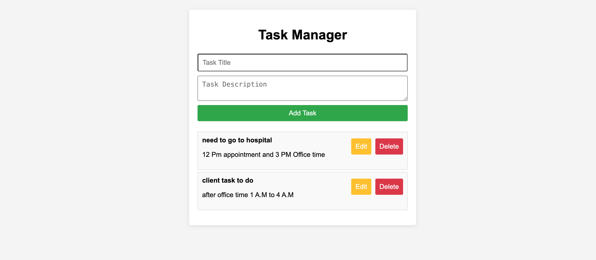

# **Tasks To-Do Manager**

A simple **Task Manager** web application built with **vanilla JavaScript, HTML, and CSS**. This app allows you to manage tasks with full **CRUD functionality** (Create, Read, Update, Delete) and stores tasks in **localStorage** to maintain them across browser sessions.

---

## **Features**

- **Add tasks**: Users can input a task title and description to create a new task.
- **View tasks**: Displays a list of tasks that are saved in local storage.
- **Edit tasks**: Users can edit existing tasks by pre-filling the form and re-saving it.
- **Delete tasks**: Tasks can be easily deleted with a click.
- **Persistent data**: Tasks are saved using `localStorage`, so they persist even after the page is refreshed or the browser is closed.

---

## **Technologies Used**

- **HTML5** for the structure
- **CSS3** for styling
- **JavaScript (ES6)** for functionality and CRUD operations
- **localStorage** for data persistence

---

## **Project Structure**

```
Tasks-to-do-Manager/
├── index.html       # The main HTML file
├── styles.css       # Styles for the task manager app
└── app.js           # Main JavaScript file containing the logic for CRUD
```

---

## **Getting Started**

To run the project locally, follow these steps:

### **1. Clone the Repository**

```bash
git clone https://github.com/attiqrehman-ar/Tasks-to-do-Manager.git
```

### **2. Open the Project**

Navigate to the project folder and open the `index.html` file in your browser:

```bash
cd Tasks-to-do-Manager
open index.html  # For MacOS
start index.html  # For Windows
```

Alternatively, you can open the project by double-clicking the `index.html` file.

---

## **How to Use**

1. **Add a Task**:
   - Fill in the "Task Title" and "Task Description" fields.
   - Click the **Add Task** button to save the task.

2. **View Tasks**:
   - Tasks will be displayed in the task list below the form.

3. **Edit a Task**:
   - Click the **Edit** button next to a task. The task’s title and description will be populated into the form. 
   - Update the details and click **Add Task** to save the edited task.

4. **Delete a Task**:
   - Click the **Delete** button next to a task to remove it from the list and local storage.

---

## **Screenshots**

### **Task Manager UI**
  <!-- Add screenshots of the app if possible -->

---

## **Future Improvements**

- Add due dates for tasks.
- Implement categories or labels for better task organization.
- Add a task completion feature with checkboxes.
- Enhance the design with modern UI frameworks (like Bootstrap).

---

## **Contributing**

Contributions are welcome! Feel free to open an issue or submit a pull request if you have suggestions or improvements.

---

## **Thanks for watching the Repo and give the rating if you like it**
